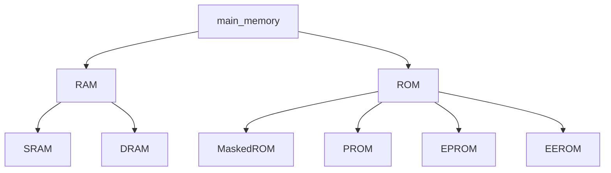
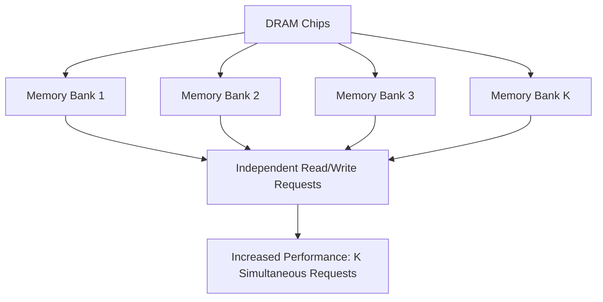

### **Semiconductor Memory Types:**

### **Dynamic RAM (DRAM):**
- ! Made with cells that store data as a <u>charge</u> on <u>capacitors</u>.
- ? Each cell stores a bit with a <u>capacitor and transistor</u>.
- ! Requires <u>periodic charge refreshing</u> to maintain data storage(The value must be refreshed every 10-100 ms).
- ? Sensitive to disturbances.
- ! Slower and cheaper than SRAM.

### **Static RAM (SRAM):**
- ! Each cell stores a bit with a <u>six-transistor</u> circuit.
- ! A digital device that uses the <u>same logic elements</u> used in the processor.
- ! Binary values are stored using <u>traditional flip-flop</u> logic gate configurations.
- ! It will <u>hold</u> its data as long as <u>power is supplied</u> to it.
- ! Relatively <u>insensitive</u> to disturbances such as electrical noise
- ! <u>Faster and more expensive</u> than DRAM.

### **SRAM versus DRAM:**
- ! Power must be <u>continuously</u> supplied to the memory to preserve the bit values.
- Dynamic:
	- @ Simpler to build, smaller.
	- @ More dense (smaller cells = more cells per unit area).
	- @ Less expensive.
	- @ Requires the supporting refresh circuitry.
	- ! Used for main memory.
- Static:
	- @ Faster.
	- ! Used for cache memory (both on and off chip).

### **Read Only Memory (ROM):**
- ? Contains a permanent pattern of data that <u>cannot</u> be changed or added to.
- ? No power source is required to <u>maintain</u> the bit values in memory.
- ! Data is actually <u>wired</u> into the chip as part of the <u>fabrication</u> process.
- ? Disadvantages of this:
	- ! <u>No room for error</u>, if one bit is wrong the whole batch of ROMs must be thrown out.
	- ? Data insertion step includes a <u>large</u> fixed cost.

### **Programmable ROM (PROM):**
- ? Less expensive.
- ! Nonvolatile and may be written into <u>only once</u>.
- ! <u>Special equipment</u> is required for the writing process.
- ? Provides flexibility.

### **Read-Mostly Memory:**
- @ **EPROM:** Erasable Programmable Readmostly Memory.
	- ! <u>Erasure</u> process can be performed repeatedly.
	- ! <u>More expensive</u> than PROM but it has the advantage of the multiple <u>update capability</u>.
- @ **EEPROM:** Electrically Erasable Programmable Readmostly Memory.
	- ! Can be <u>written into</u> at any time <u>without</u> erasing prior contents.
	- ? Combines the advantage of nonvolatility with the lexibility of being updatable in place.
	- ? More expensive than EPROM.
- @ **Flash Memory:** 
	- ? Intermediate between EPROM and EEPROM in both cost and functionality.
	- ! Uses an electrical erasing technology, <u>does not</u> provide bytelevel erasure.
	- ? Microchip is organized so that a section of memory cells are erased in a single action or “flash”.

### **Interleaved Memory:**

### **Error Correction:**
- @ **Soft Error:**
	- ? Random, <u>non-destructive</u> event that alters the contents of one or more memory cells.
	- ! No permanent damage to memory.
	 - @ Can be caused by:
		- ! Power supply problems.
- @ **Hard Failure:**
	- ? Permanent <u>physical</u> defect.
	- ? Memory cell or cells affected cannot reliably store data but become stuck at 0 or 1 or switch erratically between 0 and 1.
	- @ Can be caused by:
		- ! Harsh environmental abuse.
		- ! Manufacturing defects.

### **Error-correcting codes:**
- @ Three methods for adding bits to codes to detect a single-bit error are:
	- @ Parity Method.
	- @ Cyclic Redundancy Check (CRC).
	- ! Hamming Code.
- ! **Hamming code:** *is used to detect and correct a single-bit error in a transmitted code.* ^cac89a

### **Main Memory Improvements:**
- @ DRAM - Synchronous DRAM (SDRAM):
	- ? With synchronous access, the DRAM <u>moves</u> data in and out <u>under the control of the system clock</u> and <u>runs at the full speed of the processor/memory bus</u> without imposing <u>wait</u> states.
	- ? SDRAM has a multiple-bank internal architecture.
- @ DRAM - Double data rate DRAM (DDR-DRAM):
	- ? DDR-SDRAM <u>sends data twice</u> per clock cycle.
	- ? <u>Rising and falling</u> edge of the clock, rather than just the rising edge.
	- ? DDR uses a <u>higher</u> clock rate on the bus <u>to increase the transfer rate</u>.
- @ DRAM - Cache DRAM (CDRAM):
	- ? Integrates a small SRAM cache <u>(16 Kb) onto a generic DRAM chip</u>.
	- @ The SRAM on the CDRAM can be used in <u>two ways</u>:
		- ! True cache.
		- ! Buffer to support the serial access of a block of data.
### **External Memory:**
- Magnetic Disk:
	- ! Magnetic disks made of <u>aluminum</u> alloy or a <u>mixture of glass and ceramic covered with a magnetic coating</u>.
	- @ Benefits of the glass:
		- ? Reduction in surface defects.
		- ? Better stiffness.
		- ? Better shock/damage resistance.

### **Definitions:**
1. Hamming code: [[#^cac89a|Here]].